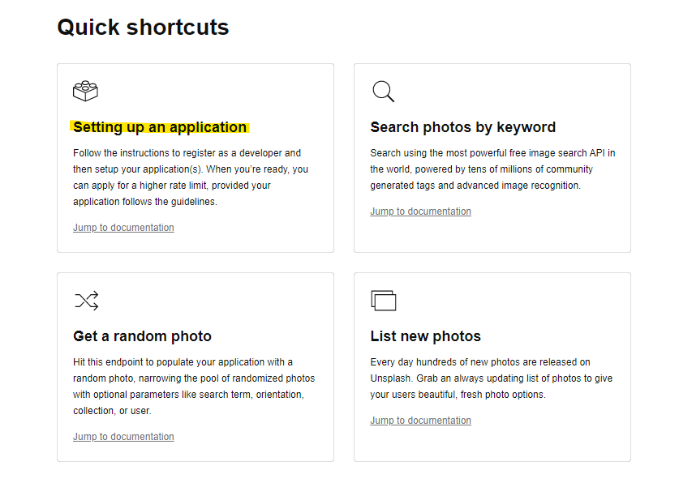
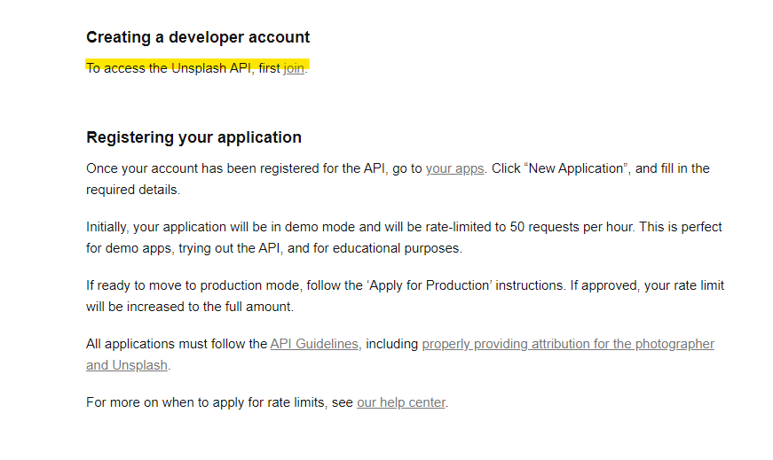
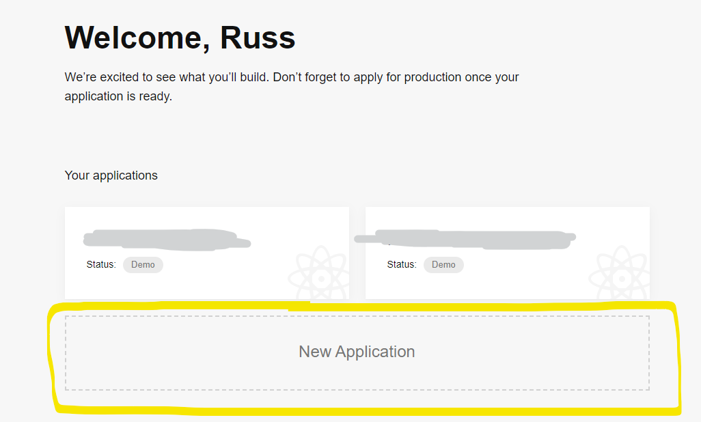
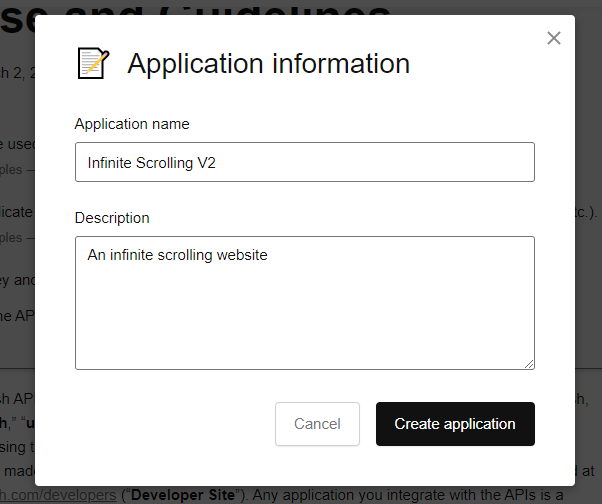
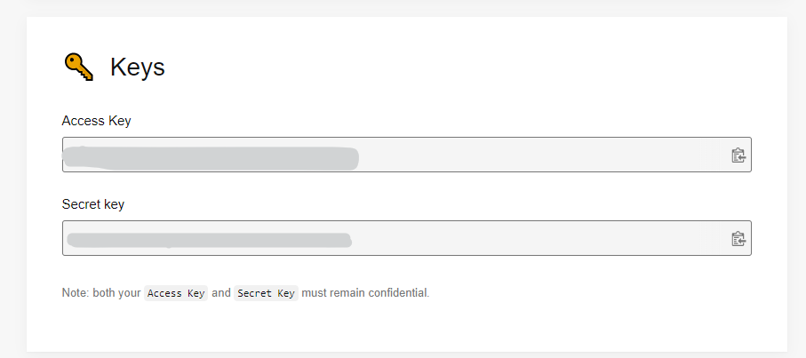
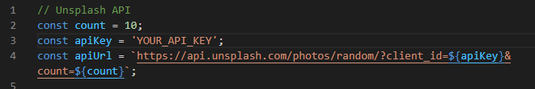

# Infinite Scrolling Website

This project was for me to learn how to create a website that will continously load photos as you scroll.

## Thoughts

This is a pretty useful skill to learn I think. A lot of websites today use infinite scrolling, or lazy loading, to constantly show new items / elements to a user. This eliminates the need for pagination and can make browsing easier.

## Important Note

This project does not have a live version for you to look at. This project requires an API key that I do not want to share publicly. If you would like to try this app out for yourself, feel free to clone it or download it.

### Steps to get this project up and running locally for you:

1. Go to [Unsplash's Developer Page](https://unsplash.com/documentation)
2. Click on "Setting Up an Application"
   
3. Click on the "Join" link under "Creating a Developer Account".
   
4. Either create an unsplash account (it's free) or sign in to an existing account.
5. Once your account is created, you will be taken to your applications page. Click "New Application"
   
6. You will need to agree to the API Use and Guidelines.
7. Enter in a name and description for the application and click "Create Application.
   
8. Once you enter your info, you will be taken to your app's page. Scroll down until you see "Keys" and your key will be here. Copy the "Access Key".
   
9. Go to the project folder and open the "app.js" file.
10. Replace the value of the "apiKey" variable with your api key wraped in quotes and save.
    
11. Now you can run the project and see it work!
